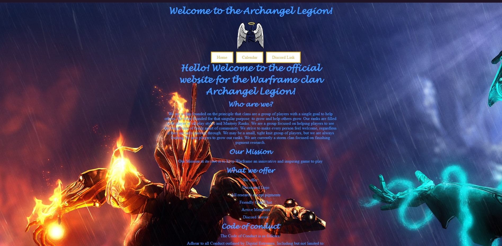

# Description
This is a webpage for the clan Archangel Legion
# What was the motivation?
I wanted to keep the material I learned in Bootcamp fresh before class started
# Why did I build it?
I wanted to challenge myself to try to build a website from scratch
# What problem does it solve?
I wanted a place where members of the clan could connect and new members could join
# What did I learn?
I learned how to use HTML to set the structure of the page. I learned how to manipulate CSS to get the look I wanted
# Screenshot

# Website
www.archangellegion.com

